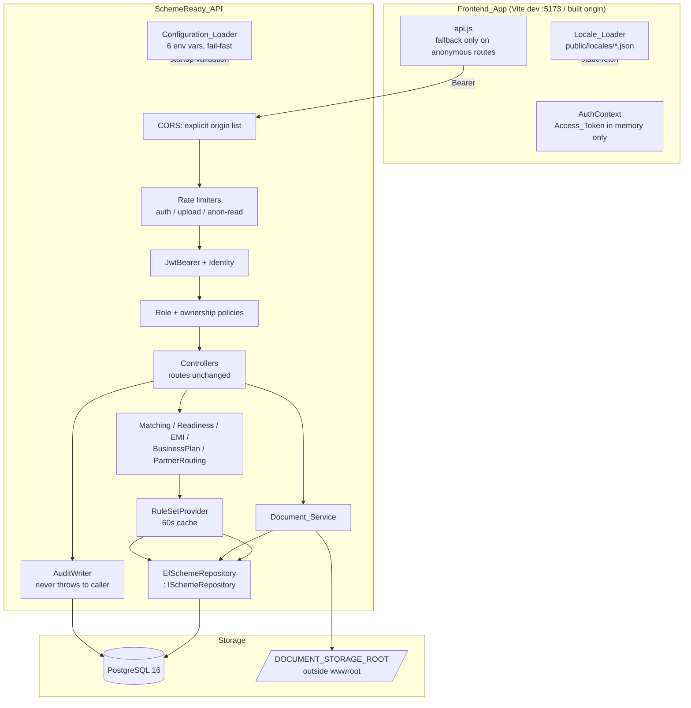
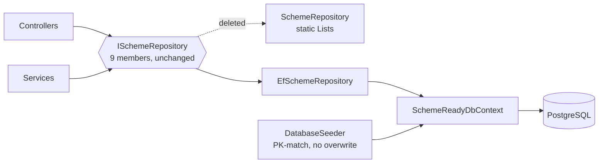
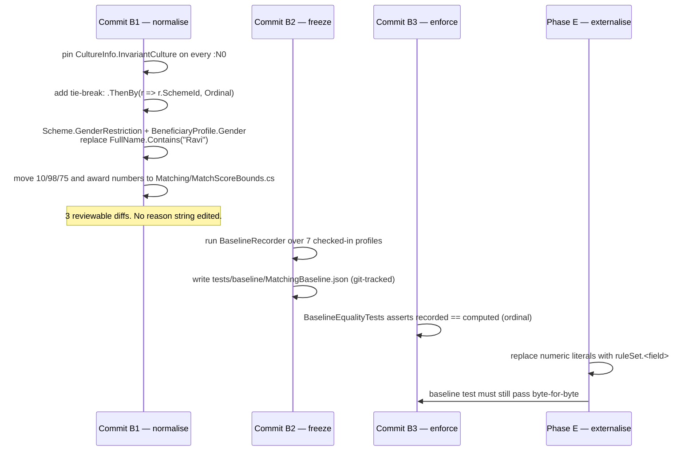
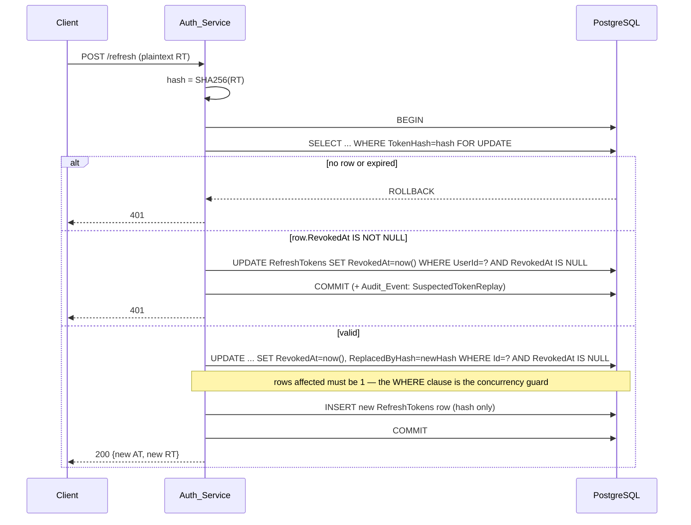
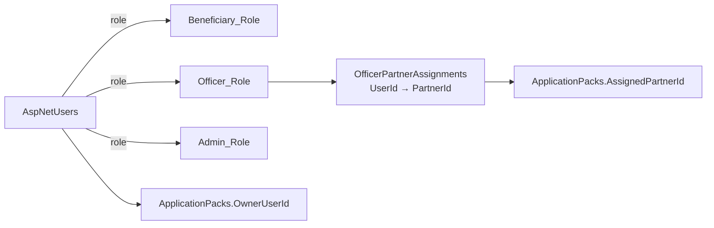
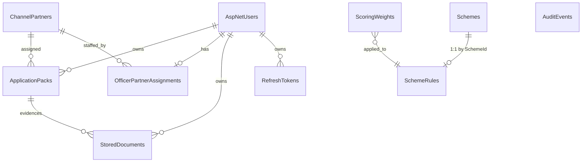

# Design Document

## Overview

This design hardens SchemeReady behind its existing seams. Three facts about the current code shape every decision below:

1. **`ISchemeRepository` is already the only data seam.** Every controller and service depends on the interface, never on `SchemeRepository`'s static `List<>` fields. So persistence is a *replacement of one implementation*, and `Program.cs` changes one line (`AddSingleton` → `AddScoped`).
2. **`SchemeMatchingService` is a single 130-line method with hand-written reason strings.** It is the product's differentiator. This design keeps the method's control flow and its string literals and replaces only the numeric literals with values resolved from a `MatchingRuleSet` record — a struct of named fields, not a bag of attributes.
3. **Nothing compiles in the sandbox** (no .NET SDK, no NuGet, no PostgreSQL). Every artifact is therefore designed to be reviewable by inspection: EF configuration is shown as literal `OnModelCreating` fragments, migrations as literal SQL, and all `dotnet`/`npm` commands are deferred to `docs/local-build-and-migrations.md` (Requirement 10).

### Facts discovered in the source that change the plan

| Finding | Consequence |
|---|---|
| `SchemeMatchingService` gates MSY on `profile.FullName.Contains("Ravi")` | R3.5 forbids name-based logic. The name→gender substitution is a **behaviour change**, so the R3.7 baseline for the gender case cannot be captured from today's code. Handled by a two-commit Phase B (below). |
| Results are `OrderByDescending(MatchScore)` only — LINQ's stable sort leaves ties in seed order | R3.4 mandates a Scheme-Id tie-break. Also a deliberate normalisation captured *before* the baseline is frozen. |
| Reason strings use `{value:N0}` with **ambient** culture | Under `en-IN` this yields `1,50,000`; under invariant, `150,000`. Determinism (R3.6) requires the culture be pinned in code before any baseline is recorded. |
| One reason string contains U+2019 (`applicant’s district`), and `Rs` appears without `₹` | Character-for-character preservation (R3.3) means the baseline test must compare with ordinal equality, and source files must stay UTF-8-with-BOM as they are today. |
| `ReadinessController.UploadDocument` computes `HasCasteCertificate = docKey == "caste_cert" \|\| true` and fabricates a profile | Existing route/verb/response schema is preserved but the body is replaced by a delegation to `Document_Service`; the canonical API is the new `/api/documents` surface. |
| `ApplicationPackController.HandoffToSuraj` mutates a list element and never persists | Under EF that mutation vanishes. Handoff must call `SaveApplicationAsync`. |
| `Scheme.EligibleBusinessTypes` matching is bidirectional `Contains` (substring both ways) | Preserved verbatim — it is why `"mobile repair"` matches `"mobile repair shop"`. |
| `api.js` fabricates readiness, application packs, handoff receipts and admin stats when the API is down | R5.11 deletes exactly those four fallbacks; the anonymous-endpoint fallbacks stay and gain provenance fields. |
| `AdminPortal.jsx` renders a hard-coded five-row partner table | Replaced by live `/api/partners` data plus the rule editor of R7.10–7.11. |

### Merge order

Each phase is independently shippable and leaves the app working.

| Phase | Requirements | Ships |
|---|---|---|
| A | R1, R2 | EF Core + PostgreSQL behind `ISchemeRepository`; idempotent seeder; `Illustrative_Flag` + `dataProvenance` end-to-end |
| B | R3 | Culture pin, tie-break, gender rule, **frozen behavioural baseline** (`MatchingBaseline.json`) + the test that enforces it |
| C | R4, R5 | Identity, JWT, refresh rotation, role gates, origin-restricted CORS; frontend auth shell |
| D | R6 | `Document_Service`, private storage root, ownership checks |
| E | R7 | `Rule_Store` + 60 s cache + admin rule editor; literals deleted from `Services.cs` |
| F | R8 | 12 `Locale_Bundle` files, `Locale_Loader`, `translations.js` deleted, parity gate |
| G | R9 | Audit table (append-only), rate limits, env-var-only secrets |
| — | R10 | `docs/local-build-and-migrations.md`, written in Phase A and extended each phase |

**Phase B must precede Phase E.** The baseline captured in B is the oracle that proves E's externalisation changed nothing.

---

## Architecture

### Request pipeline after all phases



### The persistence seam (unchanged interface)



`SchemeRepository.cs` keeps its seed *data* — the six `Scheme` and six `ChannelPartner` object initialisers move verbatim into `Data/SeedData.cs` as `static IReadOnlyList<Scheme> Schemes` / `Partners`, so review is a diff of "code deleted, literals moved". The class itself is deleted along with `schema.sql`.

### Phase B: how the behavioural baseline is captured and enforced

This is the crux of "preserved, not rewritten".



`MatchingBaseline.json` holds, per profile, the full ordered `List<SchemeMatchResult>` with every reason string. It is the contract. Phase E is only accepted when `BaselineEqualityTests` is green with `Rule_Store` seeded from `SeedData.MatchingRules`.

Three normalisations are recorded in the baseline rather than preserved from today's output, each because a requirement demands it — culture pin (R3.6), Scheme-Id tie-break (R3.4), gender-not-name (R3.5). Everything else, including all sixteen reason string templates, is byte-identical to today.

### Phase E: rule resolution and cache invalidation

```mermaid
sequenceDiagram
    participant Admin
    participant AdminCtrl as AdminRulesController
    participant Prov as RuleSetProvider
    participant Repo as IRuleStore
    participant Match as SchemeMatchingService

    Admin->>AdminCtrl: POST /api/admin/rules (5 weights + scheme thresholds)
    AdminCtrl->>AdminCtrl: validate bounds; sum(weights) == 100 else 400
    AdminCtrl->>Repo: SaveAsync (single transaction)
    Repo-->>AdminCtrl: committed
    AdminCtrl->>Prov: Invalidate()
    Note over AdminCtrl,Prov: Invalidate() happens BEFORE the 200 is written
    AdminCtrl-->>Admin: 200
    Match->>Prov: GetAsync()
    Prov->>Repo: reload (cache empty)
    Prov-->>Match: MatchingRuleSet with saved values
```

`Invalidate()` runs after commit and before the response is written, so the first request the client can possibly issue after seeing the 200 already misses the cache (R7.4).

---

## Components and Interfaces

### C1. `EfSchemeRepository` — Phase A

Implements the nine existing members with their existing signatures. No member added, none removed.

```csharp
public class EfSchemeRepository : ISchemeRepository
{
    private readonly SchemeReadyDbContext _db;

    public async Task<Scheme?> GetSchemeByIdAsync(string id)
    {
        if (string.IsNullOrWhiteSpace(id)) return null;          // R1.2 null, never throw
        return await _db.Schemes
            .FirstOrDefaultAsync(s => s.Id.ToLower() == id.ToLower());  // R1.2 case-insensitive
    }

    public async Task<Scheme> AddOrUpdateSchemeAsync(Scheme scheme)
    {
        if (string.IsNullOrWhiteSpace(scheme.Id))
            scheme.Id = $"NSFDC-CUSTOM-{Guid.NewGuid().ToString("N")[..6].ToUpper()}"; // unchanged
        var existing = await _db.Schemes.FirstOrDefaultAsync(s => s.Id == scheme.Id);
        if (existing is null) _db.Schemes.Add(scheme);
        else _db.Entry(existing).CurrentValues.SetValues(scheme);
        await _db.SaveChangesAsync();     // single SaveChanges ⇒ one transaction ⇒ all-or-nothing (R1.17)
        return scheme;
    }
}
```

`s.Id.ToLower() == id.ToLower()` translates to `lower(s."Id") = lower(@p0)` on Npgsql (`StringComparison` overloads do not translate). A functional index `ix_schemes_id_lower ON "Schemes" (lower("Id"))` is created in the migration.

`GetAdminStatsAsync` becomes SQL aggregates over `ApplicationPacks` (`GROUP BY` on business type / district, and a `jsonb`-derived count of missing documents). The response *schema* is unchanged; the values become real. The current `Math.Max(_applications.Count, 148)` demo floor is deleted — a visible change confined to the Admin-only view.

`SaveApplicationAsync` keeps its ID/reference generation and adds `OwnerUserId` and `AssignedPartnerId` persistence (Phase C/D).

### C2. `SchemeReadyDbContext` — jsonb + value comparers

Six properties are `List<string>`: `Scheme.EligibleBusinessTypes`, `RequiredDocuments`, `SupportedDistricts`, `ChannelPartner.SupportedSchemes`, `DocumentRequirements`, and `BeneficiaryProfile.UploadedDocs` (owned inside the pack dossier).

```csharp
private static readonly ValueConverter<List<string>, string> JsonListConverter = new(
    v => JsonSerializer.Serialize(v, JsonOpts),
    v => JsonSerializer.Deserialize<List<string>>(v, JsonOpts) ?? new List<string>());

private static readonly ValueComparer<List<string>> OrderedListComparer = new(
    (a, b) => a != null && b != null && a.SequenceEqual(b, StringComparer.Ordinal),
    v => v.Aggregate(0, (h, s) => HashCode.Combine(h, StringComparer.Ordinal.GetHashCode(s))),
    v => v.ToList());                                    // snapshot MUST deep-copy

protected override void OnModelCreating(ModelBuilder b)
{
    var scheme = b.Entity<Scheme>();
    scheme.ToTable("Schemes");
    scheme.HasKey(s => s.Id);
    scheme.Property(s => s.Id).HasColumnType("text").HasMaxLength(64);      // R1.5
    scheme.Property(s => s.InterestRate).HasColumnType("numeric(5,2)");    // R1.5, single column
    scheme.Property(s => s.Description).HasColumnType("text");
    scheme.Property(s => s.IsIllustrative).HasDefaultValue(true);          // R2.1

    foreach (var nav in new[] { nameof(Scheme.EligibleBusinessTypes),
                                nameof(Scheme.RequiredDocuments),
                                nameof(Scheme.SupportedDistricts) })
    {
        scheme.Property<List<string>>(nav)
              .HasColumnType("jsonb")
              .HasConversion(JsonListConverter, OrderedListComparer);      // R1.10
    }
}
```

**Why the comparer is mandatory.** With only a converter, EF snapshots the *reference*. `scheme.SupportedDistricts.Add("Kolar")` mutates the same object the snapshot points at, so `DetectChanges` compares the list to itself, finds no difference, and `SaveChanges` writes nothing — silent data loss for add, remove *and* reorder. The three-argument comparer fixes it: `v => v.ToList()` makes the snapshot an independent copy, and `SequenceEqual(..., Ordinal)` makes comparison order-sensitive so a pure reorder (`["A","B"]` → `["B","A"]`) is detected as a change. `StringComparer.Ordinal` — not the default comparer — keeps `"SC"` and `"sc"` distinct.

`ApplicationPack` is stored as a header row plus one `jsonb` `FullDossierJson` column (mirroring the intent of the old `schema.sql`), with `Profile`, `SelectedScheme`, `DocumentChecklist`, `ProjectReport`, `EmiPlan` and `NearestPartner` serialised into it. Header columns (`OwnerUserId`, `AssignedPartnerId`, `TrackingStatus`, `SelectedSchemeId`, `GeneratedDate`) are promoted for querying and authorisation. Round-tripping the dossier is covered by Property 1.

### C3. `DatabaseSeeder` — idempotent, never overwrites

```csharp
public async Task SeedAsync(CancellationToken ct)
{
    foreach (var seed in SeedData.Schemes)                       // 6 rows, verbatim from SeedSchemes()
        if (!await _db.Schemes.AnyAsync(s => s.Id == seed.Id, ct))
            _db.Schemes.Add(seed);                              // insert only when PK absent
    // identical loop for SeedData.Partners (6 rows) and SeedData.MatchingRules (Phase E)
    await _db.SaveChangesAsync(ct);
}
```

Existence-check-then-insert, never `Update`. Second run inserts nothing and touches nothing, so an admin-edited `IncomeLimit` or an `IsIllustrative = false` verification survives every subsequent startup (R1.13, R1.14). Runs once at startup after `Database.Migrate()`; `dotnet run --seed-only` exposes it for the R10 command list.

### C4. `SchemeMatchingService` — before/after

```csharp
// Phase B (normalised, still literal)
if (profile.AnnualFamilyIncome <= scheme.IncomeLimit) {
    eligibilityScore += 20;
    positiveReasons.Add($"Declared family income (Rs {profile.AnnualFamilyIncome.ToString("N0", Inv)}) is within the configured threshold of Rs {scheme.IncomeLimit.ToString("N0", Inv)}.");
}

// Phase E (value sourced from Rule_Store, string untouched)
if (profile.AnnualFamilyIncome <= rules.IncomeLimit) {
    eligibilityScore += Awards.EligibilityIncome(rules.Weights.Eligibility);
    positiveReasons.Add($"Declared family income (Rs {profile.AnnualFamilyIncome.ToString("N0", Inv)}) is within the configured threshold of Rs {rules.IncomeLimit.ToString("N0", Inv)}.");
}
```

`Inv` is `CultureInfo.InvariantCulture`, a `private static readonly` field. The frontend independently formats with `en-IN` grouping (R8.11); backend reason strings stay invariant (`150,000`) because R3.3 requires only "thousands separators and no decimal places" and because a culture-dependent string cannot be a stable baseline. This asymmetry is deliberate.

`Matching/MatchScoreBounds.cs` and `Matching/Awards.cs` hold every remaining number, so `Services.cs` satisfies R7.3's "no numeric threshold or weight literal" literally:

```csharp
internal static class MatchScoreBounds        // engine invariants fixed by R3.4, not Rule_Store data
{
    internal const int ClampMin = 10, ClampMax = 98, RecommendedAtOrAbove = 75;
}

internal static class Awards                  // partial awards as exact integer fractions of the weight
{
    private static int Scale(int weight, int num, int den) => (weight * num + den / 2) / den;
    internal static int EligibilityCategory(int w) => Scale(w, 20, 40);   // w=40 → 20
    internal static int EligibilityIncome(int w)   => Scale(w, 20, 40);   // w=40 → 20
    internal static int GenderPenalty(int w)       => Scale(w, 15, 40);   // w=40 → 15, floored at 0
    internal static int CostInRange(int w)         => w;                  // w=25 → 25
    internal static int CostBelowMin(int w)        => Scale(w,  8, 25);   // w=25 → 8
    internal static int CostAboveMax(int w)        => Scale(w,  5, 25);   // w=25 → 5
    internal static int DocCaste(int w)            => Scale(w,  8, 15);   // w=15 → 8
    internal static int DocIncome(int w)           => Scale(w,  7, 15);   // w=15 → 7
    internal static int PartnerPresent(int w)      => w;                  // w=10 → 10
    internal static int PartnerAbsent(int w)       => Scale(w,  4, 10);   // w=10 → 4
    internal static int BusinessMatch(int w)       => w;
    internal static int BusinessMismatch(int w)    => Scale(w,  4, 10);
}
```

Because the seeded weights equal the denominators, every award is *exactly* the number in `Services.cs` today — integer arithmetic, no rounding drift, so R3.7's zero-tolerance equality holds. An admin who moves eligibility to 44 gets proportional awards (22/22) rather than a broken engine.

Category matching moves from the hard-coded `"SC" || "Safai Karamchari"` test to `rules.EligibleCategories.Contains(profile.Category, OrdinalIgnoreCase)`, seeded as `["SC", "Safai Karamchari"]` per scheme — same behaviour, now editable.

The EMI-projection constants inside matching (`Math.Min(profile.RequiredLoanAmount, scheme.MaximumProjectCost * 0.90m)`, `Math.Min(36, scheme.MaximumTenureMonths)`) are neither eligibility thresholds nor scoring weights; they move to `Matching/EmiProjection.cs` as named constants and keep their values.

### C5. `IRuleStore` / `RuleSetProvider` — Phase E

```csharp
public interface IRuleStore
{
    Task<IReadOnlyDictionary<string, SchemeRuleRow>> GetSchemeRulesAsync(CancellationToken ct);
    Task<ScoringWeights> GetWeightsAsync(CancellationToken ct);
    Task SaveSchemeRuleAsync(SchemeRuleRow row, string actorId, CancellationToken ct);
    Task SaveWeightsAsync(ScoringWeights weights, string actorId, CancellationToken ct);
}

public sealed class RuleSetProvider : IRuleSetProvider          // registered Singleton
{
    private readonly SemaphoreSlim _gate = new(1, 1);
    private (MatchingRuleSet Set, DateTimeOffset LoadedAt)? _cache;
    private static readonly TimeSpan Ttl = TimeSpan.FromSeconds(60);   // R7.4

    public async Task<MatchingRuleSet> GetAsync(CancellationToken ct)
    {
        if (_cache is { } c && DateTimeOffset.UtcNow - c.LoadedAt < Ttl) return c.Set;
        await _gate.WaitAsync(ct);
        try
        {
            if (_cache is { } c2 && DateTimeOffset.UtcNow - c2.LoadedAt < Ttl) return c2.Set;
            var set = await LoadAndValidateAsync(ct);   // throws RuleStoreUnavailableException on failure
            _cache = (set, DateTimeOffset.UtcNow);
            return set;
        }
        finally { _gate.Release(); }
    }

    public void Invalidate() => _cache = null;
}
```

No stale-serve-on-failure: if the store is unreachable and the cache is older than 60 s, `GetAsync` throws and matching returns 503 rather than substituting defaults (R7.5). Startup calls `LoadAndValidateAsync` once and refuses to start on missing components or `sum != 100` (R7.8).

`MatchingRuleSet` is a record of named fields — `MinimumAge`, `MaximumAge`, `IncomeLimit`, `MinimumProjectCost`, `MaximumProjectCost`, `EligibleBusinessTypes`, `EligibleCategories`, `GenderRestriction`, `InterestRate`, `MaximumTenureMonths`, `MoratoriumMonths`, `Weights` — read by name at each of the five call sites. There is no reflection, no attribute lookup, no rule DSL.

### C6. `Auth_Service` — Phase C

```
POST /api/auth/signup   → 201 | 400 | 409        anonymous, rate-limited
POST /api/auth/login    → 200 {accessToken, refreshToken} | 401 | 423
POST /api/auth/refresh  → 200 {accessToken, refreshToken} | 401
POST /api/auth/logout   → 204                    requires Access_Token
GET  /api/auth/me       → 200 {userId, displayName, roles}
```

Access token: HS256, 15 min, claims `sub`, `name`, `role[]`, `partner_id` for officers. `TokenValidationParameters.ClockSkew = TimeSpan.FromSeconds(60)` — the default is five minutes and violates R4.20. Lockout uses Identity's `MaxFailedAccessAttempts = 5`, `DefaultLockoutTimeSpan = 15 min`; the login handler maps `IsLockedOut` to **423** before verifying the password, so a correct password during lockout still gets 423.

Unknown-email and wrong-password paths share one code path returning a single `const string` message, guaranteeing R4.6's byte-identical response.

**Refresh rotation.** The ordering is what makes replay impossible:



Revocation of the presented token is committed **inside the same transaction** that inserts the replacement, and the conditional `WHERE RevokedAt IS NULL` under `FOR UPDATE` means two concurrent presentations of one token produce exactly one winner; the loser sees `RevokedAt IS NOT NULL` and takes the replay branch, which revokes the whole family (R4.10, R4.11). Only the hash is ever stored; plaintext exists once, in the response body.

### C7. Authorization model — ownership, not just roles



`ApplicationPackAccessService.CanRead(pack, principal)` returns true when the principal holds Admin, **or** owns the pack, **or** holds Officer and `pack.AssignedPartnerId == principal.FindFirst("partner_id").Value`. Every negative outcome — including "exists but not yours" — returns **404** with an empty body, so existence is not disclosed (R4.19, R6.16). The officer's partner association is a row in `OfficerPartnerAssignments`, projected into the `partner_id` claim at token issue so authorisation needs no extra query.

`AssignedPartnerId` is set at pack generation from the routed `nearestPartner.Id` — a value the current code already computes but discards.

### C8. `Document_Service` — Phase D

```
POST   /api/documents            multipart: file + docKey  → 201 | 400 | 401 | 429
GET    /api/documents/{id}                                 → 200 bytes | 401 | 404
DELETE /api/documents/{id}                                 → 204 | 401 | 404
GET    /api/documents/mine                                 → 200 metadata list
POST   /api/readiness/upload-doc  (existing route retained, now delegates)
```

Validation order is fixed and short-circuiting, because R6.6 requires the message to name the *first* failed check: **extension → content-type → magic bytes → length**. Nothing is written to disk until all four pass; the file is buffered through `Stream.CopyToAsync` into a temp file under the storage root, validated, then `File.Move`d — so a rejected upload leaves no partial artefact (R6.20).

Storage layout, deliberately outside `wwwroot` (which this API does not even serve):

```
$DOCUMENT_STORAGE_ROOT/
  documents/{ownerUserId}/{32-hex-char-random}.pdf     ← 128 bits from RandomNumberGenerator
  tmp/{guid}.part                                      ← same volume, so Move is atomic
```

Retrieval takes only the database identifier. No request parameter carries a filename or path, so there is no traversal surface to sanitise (R6.12). Responses carry `Content-Disposition: attachment; filename="<sanitised>"` and `X-Content-Type-Options: nosniff`.

The client filename is metadata only: truncated to 255 chars, stripped of `/ \ :` and control chars, and rendered by React as a text child (`{doc.originalFileName}`) which escapes markup by construction — the current `ReadinessDashboard.jsx` already renders `item.uploadedFileName` this way, so no change is needed there beyond wiring real data (R6.8).

Replacement (R6.11): upload for a key that already has a live document marks the old row `DeletedAt = now()` and deletes its bytes inside the same transaction as the new insert, keeping at most one live document per `(OwnerUserId, DocumentKey)` — enforced additionally by a partial unique index.

Readiness recalculation (R6.10) projects live documents onto the existing profile shape and calls the **unmodified** `IReadinessService`:

| DocumentKey | Projection |
|---|---|
| `identity` | `UploadedDocs += "Aadhaar/KYC"` |
| `caste_cert` | `HasCasteCertificate = true`, `UploadedDocs += "Caste certificate"` |
| `income_cert` | `HasIncomeCertificate = true`, `UploadedDocs += "Income certificate"` |
| `quotation` | `UploadedDocs += "Business quotation"` |

### C9. `AuditWriter` — Phase G

```csharp
public async Task WriteAsync(AuditEvent e, CancellationToken ct)
{
    try
    {
        await using var scope = _scopeFactory.CreateAsyncScope();   // own DbContext + own transaction
        var db = scope.ServiceProvider.GetRequiredService<SchemeReadyDbContext>();
        db.AuditEvents.Add(e);
        await db.SaveChangesAsync(ct);
    }
    catch (Exception ex)
    {
        _logger.LogError(ex, "Audit write failed for {ActionType} on {EntityType}", e.ActionType, e.EntityType);
    }                                                              // swallowed: R9.7
}
```

A separate scope is essential — writing the audit row through the request's `DbContext` would enlist it in the business transaction, so an audit failure would roll back the business write and an audit *success* would be undone by a business rollback. Independent scope, independent transaction, failure logged and swallowed: the originating request returns exactly the response it would have returned anyway.

Append-only is enforced at the database, not in code. EF has no model concept for grants, so the migration carries raw SQL:

```csharp
migrationBuilder.Sql("""
    REVOKE UPDATE, DELETE ON "AuditEvents" FROM CURRENT_USER;
    GRANT INSERT, SELECT ON "AuditEvents" TO CURRENT_USER;
    """);
```

`CURRENT_USER` is the application role running the migration; the R10 doc notes that a deployment separating migration and runtime roles substitutes the runtime role name. No API operation updates or deletes an audit row (R9.6).

### C10. Rate limiting — Phase G

.NET 8 `AddRateLimiter`, three named policies read from configuration with the R9 values as code defaults:

| Policy | Partition | Limit | Applied to |
|---|---|---|---|
| `auth` | source IP | 10 / 15 min | signup, login, refresh (shared partition key, so the budget is combined) |
| `doc-upload` | user id | 20 / 60 min | `POST /api/documents`, `POST /api/readiness/upload-doc` |
| `anon-read` | source IP | 100 / 60 s | the eight anonymous endpoints of R4.16 |

`RejectionStatusCode = 429`; `OnRejected` writes `Retry-After` from `metadata.RetryAfter.TotalSeconds`, clamped to `[1, windowSeconds]`. Fixed-window limiters count every request including rejected-downstream ones, satisfying "regardless of outcome". Source IP comes from `HttpContext.Connection.RemoteIpAddress` with `ForwardedHeadersOptions` enabled only for configured known proxies.

### C11. `Configuration_Loader` — Phase G

```csharp
public static AppSecrets LoadOrFail(IConfiguration cfg, ILogger log)
{
    string[] keys = { "SCHEMEREADY_DB_CONNECTION", "SCHEMEREADY_JWT_SIGNING_KEY",
                      "SCHEMEREADY_JWT_ISSUER", "SCHEMEREADY_JWT_AUDIENCE",
                      "SCHEMEREADY_CORS_ORIGINS", "SCHEMEREADY_DOCUMENT_ROOT" };
    var missing = keys.Where(k => string.IsNullOrWhiteSpace(cfg[k])).ToArray();
    if (missing.Length > 0)
    {
        log.LogCritical("Missing required configuration: {Keys}", string.Join(", ", missing));
        throw new ConfigurationMissingException(missing);   // before app.Run() ⇒ no request served
    }
    ...
}
```

`appsettings.json` keeps only self-describing placeholders (`"DefaultConnection": "SET VIA ENV SCHEMEREADY_DB_CONNECTION"`) and its SQL-Server connection string is rewritten to Npgsql keywords for documentation purposes only (R1.11, R9.15).

### C12. Frontend components — Phases C, D, F

| Module | Change |
|---|---|
| `src/auth/AuthContext.jsx` (new) | Access token in a `useRef` (never `localStorage`); refresh token in `localStorage`; exposes `user`, `roles`, `login`, `signup`, `logout` |
| `src/auth/tokenFetch.js` (new) | Single-flight refresh: a module-level `let refreshPromise` shared by all 401s, `AbortController` at 10 s, one retry per original request, no second refresh (R5.6) |
| `src/auth/LoginForm.jsx`, `SignupForm.jsx` (new) | Client-side validation per R5.2; retains email, clears passwords |
| `src/api.js` | Fallbacks deleted from `getReadiness`, `generateApplicationPack`, `handoffToSuraj`, `getAdminStats`; those now `throw ApiError`. Remaining fallbacks gain `isIllustrative: true` + `dataProvenance` (R2.9) |
| `src/i18n/LocaleLoader.js` (new) | `Map<lang, bundle>` cache, one fetch per code per session, 5 s `AbortController`, en fallback, `Set` of already-warned key paths |
| `src/i18n/useT.js` (new) | `t('schemes.whyMatches')` dotted resolution replacing `t.schemes.whyMatches` member access |
| `src/components/IllustrativeBadge.jsx` (new) | `<span>Illustrative data — not verified</span>`, rendered when `record.isIllustrative !== false` — so a *missing* flag also badges (R2.3, R2.4) |
| `App.jsx` | `translations` import removed; wraps content in `AuthProvider` + `LocaleProvider`; admin tab gated on `roles.includes('Admin')`; unauthenticated navigation restricted to onboarding/schemes/emi/businessPlan (R5.8) |
| `ReadinessDashboard.jsx` | `handleSimulatedUpload` replaced by a real `<input type="file">` → `POST /api/documents`, score from the 201 body |
| `AdminPortal.jsx` | Hard-coded partner array replaced by `/api/partners`; adds the rule editor: inputs for every R7.1 field, live weight sum after each keystroke, save disabled unless sum is 100 and all values in bounds, and a preview panel showing pending-vs-stored `MatchScore` + full explanation side by side (R7.10, R7.11) |
| `ExplainableSchemeResults.jsx` | Hard-coded `"10 September 2026 (NSFDC Portal)"` replaced by `scheme.lastVerifiedDate`; badge added beside name, rate, source and verified date |
| `src/format.js` (new) | `formatInr(n)` via `new Intl.NumberFormat('en-IN')` → `1,50,000`, used for all currency in all twelve languages (R8.11) |

Locale bundles: `public/locales/{en,hi,kn,ta,te,ml,mr,bn,gu,pa,or,as}.json`. `en`, `hi`, `kn` are mechanically transcribed from `translations.js` — including the four ungrouped root keys `appTitle`, `appSubtitle`, `tagline`, `demoPersonaBtn` — preserving every key path and value (R8.3). `scripts/check-locale-parity.mjs` walks the `en` bundle, diffs key paths against the other eleven, prints every gap and exits non-zero; wired into `npm run build` via a `prebuild` script (R8.14).

---

## Data Models

### New and changed entities



**`Scheme` (existing — additive only)**

| Property | Column | Notes |
|---|---|---|
| `Id` string | `text` PK, ≤64 | unchanged format `NSFDC-MCS-01` |
| `InterestRate` decimal | `numeric(5,2)` | single column, 0.00–99.99 |
| `EligibleBusinessTypes`, `RequiredDocuments`, `SupportedDistricts` | `jsonb` | converter + ordered comparer |
| `IsIllustrative` bool **(new)** | `boolean NOT NULL DEFAULT true` | R2.1 |
| `VerificationSourceReference` string? **(new)** | `text` ≤300 | required when clearing the flag |
| `VerifiedOn` DateTime? **(new)** | `timestamptz` | must not be in the future |
| `GenderRestriction` string **(new)** | `text NOT NULL DEFAULT 'Any'` | `Any` \| `Female` \| `Male` |

`ChannelPartner` gains the same three verification fields. `BeneficiaryProfile` gains `Gender` (`Any`/`Female`/`Male`, default `Any`) — required to retire the `FullName.Contains("Ravi")` rule. Both are additive to request bodies and optional, so R1.4 holds.

**`SchemeMatchResult` (existing — additive only)**: `IsIllustrative` bool, `DataProvenance` string?. Emitted as additional JSON properties; no existing property removed or renamed. `dataProvenance` reads: *"Interest rate, cited source document and last-verified date are illustrative sample values pending verification against current official NSFDC guidelines."* and is **omitted entirely** once `IsIllustrative` is false (R2.5).

**`SchemeRules`** (Rule_Store, one row per scheme)

| Column | Type | Bound |
|---|---|---|
| `SchemeId` | `text` PK/FK | → `Schemes.Id` |
| `MinimumAge`, `MaximumAge` | `int` | 18–75, min ≤ max |
| `IncomeLimit` | `numeric(12,2)` | 0.01–99 999 999.99 |
| `MinimumProjectCost`, `MaximumProjectCost` | `numeric(12,2)` | 1 000–100 000 000, min ≤ max |
| `EligibleBusinessTypes` | `jsonb` | 1–20 items, each 1–100 chars |
| `EligibleCategories` | `jsonb` | 1–10 items, each 1–100 chars |
| `GenderRestriction` | `text` | `Any`/`Female`/`Male` |
| `InterestRate` | `numeric(5,2)` | 0.00–36.00 |
| `MaximumTenureMonths` | `int` | 1–240 |
| `MoratoriumMonths` | `int` | 0–60, ≤ tenure |

**`ScoringWeights`** — exactly five rows, `ComponentName` (`Eligibility`, `ProjectCostFit`, `DocumentReadiness`, `PartnerAvailability`, `BusinessTypePreference`) PK, `Weight int` 0–100, `CHECK` constraint on range plus an application-level and startup-level "sum = 100" check. Seeded 40/25/15/10/10.

**`RefreshTokens`**

| Column | Type | Notes |
|---|---|---|
| `Id` | `uuid` PK | |
| `UserId` | `text` FK | → `AspNetUsers.Id` |
| `TokenHash` | `text` UNIQUE | SHA-256 of plaintext; plaintext never stored |
| `IssuedAt`, `ExpiresAt` | `timestamptz` | 7-day lifetime |
| `RevokedAt` | `timestamptz` NULL | NULL = live |
| `ReplacedByHash` | `text` NULL | rotation chain, for replay forensics |

Index `(UserId) WHERE "RevokedAt" IS NULL` makes family revocation a single statement.

**`StoredDocuments`**

| Column | Type | Notes |
|---|---|---|
| `Id` | `uuid` PK | the only public handle |
| `OwnerUserId` | `text` FK | |
| `ApplicationPackId` | `text` FK NULL | enables officer access |
| `DocumentKey` | `text` | `identity`/`caste_cert`/`income_cert`/`quotation` |
| `OriginalFileName` | `text` ≤255 | sanitised metadata |
| `StoredFileName` | `text` | 32 hex chars + extension |
| `ContentType`, `ByteLength` | `text`, `bigint` | 1–5 242 880 |
| `Sha256` | `text` | integrity check for the round-trip property |
| `UploadedAt`, `DeletedAt` | `timestamptz` | soft delete |

Partial unique index `("OwnerUserId", "DocumentKey") WHERE "DeletedAt" IS NULL` enforces R6.11 at the database.

**`AuditEvents`**

| Column | Type | Notes |
|---|---|---|
| `Id` | `bigint GENERATED BY DEFAULT AS IDENTITY` PK | R1.7 — replaces `IDENTITY(1,1)` |
| `OccurredAt` | `timestamptz NOT NULL` | UTC, second precision or better |
| `ActorId` | `text NOT NULL` | user id, or `"anonymous"` |
| `ActionType` | `text NOT NULL` | closed set: `AuthAttempt`, `AuthorizationDenied`, `DocumentUpload`, `DocumentRetrieval`, `DocumentDeletion`, `SchemeChange`, `PartnerChange`, `ScoringWeightChange`, `IllustrativeFlagChange`, `ApplicationHandoff`, `PersistenceFailure`, `SuspectedTokenReplay` |
| `EntityType`, `EntityId` | `text NOT NULL` | `EntityId` = `""` when no target |
| `SourceIpAddress` | `text NOT NULL` | |
| `Outcome` | `text NOT NULL` | exactly `Success` or `Failure` |
| `Detail` | `jsonb NULL` | field-level before/after for rule edits; a serialiser allow-list keeps tokens, hashes and bytes out (R9.3) |

Index on `OccurredAt DESC` for the admin query; retention ≥365 days is a documented operational policy plus the absence of any delete path.

### Type mapping from the deleted `schema.sql`

| MS SQL (deleted) | PostgreSQL 16 |
|---|---|
| `NVARCHAR(n)` / `NVARCHAR(MAX)` prose | `text` |
| `NVARCHAR(MAX)` holding `...Json` | `jsonb` |
| `DECIMAL(18,2)` | `numeric(12,2)` |
| `DECIMAL(5,2)` | `numeric(5,2)` |
| `DATETIME2` | `timestamptz` |
| `BIT` | `boolean` |
| `FLOAT` | `double precision` |
| `INT IDENTITY(1,1)` | `bigint GENERATED BY DEFAULT AS IDENTITY` |
| `IF NOT EXISTS ... CREATE DATABASE`, `USE`, `GO` | removed; database creation is a documented `createdb` step |


---

## Correctness Properties

*A property is a characteristic or behavior that should hold true across all valid executions of a system — essentially, a formal statement about what the system should do. Properties serve as the bridge between human-readable specifications and machine-verifiable correctness guarantees.*

Twenty-four properties survive redundancy elimination. Criteria classified as SMOKE (static schema/source facts), INTEGRATION (infrastructure failure paths), or EXAMPLE (specific DOM or lifecycle behaviours) are covered by the Testing Strategy below rather than by properties.

### Property 1: Entity persistence round-trip

*For any* `Scheme`, `ChannelPartner`, or `ApplicationPack` instance, writing it through `ISchemeRepository` and reading the same identifier back through a **freshly constructed** `DbContext` yields an instance whose every mapped property equals the written value, including the element order and element contents of every `List<string>` property and the full dossier payload.

**Validates: Requirements 1.3, 1.15**

### Property 2: Identifier resolution is case-insensitive and null-safe

*For any* stored identifier and any case permutation of it, `GetSchemeByIdAsync` / `GetPartnerByIdAsync` returns that row; *for any* string that is null, empty, whitespace-only, or matches no stored row, they return null without throwing.

**Validates: Requirements 1.2**

### Property 3: Collection change tracking detects add, remove, and reorder

*For any* stored `List<string>` property and any mutation drawn from {append an element, remove an element, apply a non-identity permutation}, saving after the mutation and reloading yields a collection equal to the mutated collection with the mutated element order.

**Validates: Requirements 1.10**

### Property 4: Seeding is idempotent and never overwrites

*For any* number of seeder runs from 1 to 5, and any set of field edits applied to seeded rows between runs, the `Scheme` row count remains 6, the `ChannelPartner` row count remains 6, no duplicate primary key exists, and every edited field value is unchanged.

**Validates: Requirements 1.12, 1.13, 1.14**

### Property 5: Failed writes are atomic

*For any* write method among `AddOrUpdateSchemeAsync`, `AddOrUpdatePartnerAsync`, `SaveApplicationAsync`, and any generated entity, injecting a failure part-way through the save leaves every stored record equal to its pre-call value with no partial column or collection update, and surfaces an error to the caller.

**Validates: Requirements 1.17**

### Property 6: Provenance accompanies illustrative data exactly

*For any* generated mix of illustrative and verified `Scheme` rows, and any of the five scheme-bearing response types (match results, readiness results, application pack, partner routing, admin scheme listing), every emitted scheme object carries a `dataProvenance` property equal to the canonical provenance text **if and only if** its `isIllustrative` value is true.

**Validates: Requirements 2.2, 2.5**

### Property 7: Clearing the illustrative flag requires admin, a bounded reference, and a non-future date

*For any* triple of (requester role, verification source reference, verification date), the request to set `isIllustrative = false` succeeds if and only if the role is Admin, the reference length is 1 to 300 characters, and the date is not later than the current date; on every rejection the stored flag remains true and exactly one audit event is recorded either way.

**Validates: Requirements 2.6, 2.7**

### Property 8: Every result carries a complete explanation

*For any* generated `BeneficiaryProfile`, every returned `SchemeMatchResult` has at least one string across `PositiveReasons` and `NegativeReasons`, has at least one positive reason for each score component awarded its maximum, at least one negative reason for each component awarded less than its maximum, and lists in `MissingDocuments` exactly one entry per mandatory certificate the profile does not declare.

**Validates: Requirements 3.2**

### Property 9: Score bounds, recommendation biconditional, and total ordering

*For any* generated `BeneficiaryProfile`, every `MatchScore` lies in the inclusive range 10 to 98, `IsRecommended` is true if and only if `MatchScore >= 75`, and the returned list is ordered by `MatchScore` descending with ties broken by `SchemeId` ascending ordinal.

**Validates: Requirements 3.4**

### Property 10: Gender restriction applies; applicant name never does

*For any* generated profile and any arbitrary replacement `FullName`, every returned result is deeply equal including all reason strings (name-independence); and *for any* pair of (scheme gender restriction, profile gender), the eligibility component is reduced by exactly the gender penalty floored at 0 precisely when the restriction is declared and unsatisfied, and is unreduced when the restriction is `Any`.

**Validates: Requirements 3.5**

### Property 11: Matching is deterministic within a process

*For any* generated `BeneficiaryProfile`, three consecutive invocations against unchanged `Rule_Store` contents return identical `MatchScore` values, identical `IsRecommended` values, identical result ordering, and identical reason string contents in identical order.

**Validates: Requirements 3.6**

### Property 12: Invalid rule data fails loudly with no partial results

*For any* rule field and any value outside its declared bounds, or any required rule value removed, the matching request fails with an error naming the affected scheme and value, substitutes no default, and returns no results.

**Validates: Requirements 3.8, 7.5**

### Property 13: Signup accepts exactly the valid credential space

*For any* triple of (email, password, display name), signup returns 201 and creates one account with the Beneficiary role if and only if the email is 5 to 254 characters with exactly one `@` and a non-empty part on each side, the password is 12 to 128 characters containing at least one letter and one digit, and the display name is 1 to 100 characters; otherwise it returns 400, names each unmet rule, and creates no account. *For any* case permutation of an existing email it returns 409, creates no account, and discloses no password, role, or lockout state. No response body contains the submitted password.

**Validates: Requirements 4.1, 4.2, 4.3, 4.4**

### Property 14: Lockout follows the reference attempt model

*For any* sequence of up to 10 login attempts against one account, each attempt either correct or incorrect, the observed status codes equal those produced by a reference model in which five failures within 15 minutes lock the account for 15 minutes and a correct password during the lock still yields 423; a success resets the counter; and every 401 body is byte-identical.

**Validates: Requirements 4.5, 4.6, 4.7**

### Property 15: Refresh tokens are single-use and replay revokes the family

*For any* rotation chain of length 1 to 10, presenting any already-consumed refresh token never yields a token pair — it returns 401 and revokes every refresh token belonging to that user with one audit event classified as suspected replay; presenting an expired or unrecognised token returns 401 without issuing tokens; and *for any* pair of concurrent presentations of a single live token, exactly one presentation receives 200.

**Validates: Requirements 4.10, 4.11, 4.12**

### Property 16: The endpoint authorization matrix holds for every endpoint and principal

*For any* pair of (endpoint, principal kind) drawn from the declared matrix of all API endpoints against {anonymous, Beneficiary, Officer, Admin, expired token, tampered signature}, the observed outcome class equals the required one — success for permitted combinations, 401 for absent or invalid tokens, 403 for a valid token lacking the required role — every 403 records exactly one audit event, and no stored data changes on any 401 or 403.

**Validates: Requirements 4.14, 4.15, 4.16, 4.20, 4.21**

### Property 17: Resource ownership decides access identically for packs and documents

*For any* tuple of (owner identity, assigned partner, requester identity, requester role, requester partner association, resource kind ∈ {ApplicationPack, StoredDocument}, operation ∈ {read, delete}), access is granted exactly when the requester holds Admin, or is the owner, or holds Officer and their partner association equals the resource's assigned partner (read only); every denial and every non-existent or soft-deleted target returns 404 with a body containing no field value of the resource and leaves all stored bytes and metadata unchanged.

**Validates: Requirements 4.17, 4.18, 4.19, 6.13, 6.14, 6.15, 6.16, 6.18**

### Property 18: CORS admits exactly the configured origins

*For any* origin string, including near-misses differing only by scheme, port, trailing slash, or subdomain, the preflight response carries an `Access-Control-Allow-Origin` header if and only if the origin is exactly present in the configured list, and no part of the requested operation is performed for a rejected origin.

**Validates: Requirements 4.22, 4.23**

### Property 19: Bearer headers and offline fallbacks follow endpoint protection

*For any* exported `api.js` function, the outgoing request carries an `Authorization: Bearer` header if and only if its endpoint requires a token; and with `fetch` stubbed to reject, the call resolves to a fallback value if and only if its endpoint is anonymous — otherwise it rejects with an API error, displays no fabricated field values, and leaves previously loaded data unchanged.

**Validates: Requirements 5.5, 5.11**

### Property 20: Refresh is single-flight with exactly one retry

*For any* count n from 1 to 20 of simultaneous requests receiving 401, the refresh endpoint receives exactly one call, each of the n original requests is retried exactly once with the new access token, and no second refresh or second retry occurs; a refresh that has not completed within 10 seconds is treated as failed.

**Validates: Requirements 5.6**

### Property 21: Navigation gating matches session and role

*For any* triple of (target view, session presence, held role set), the rendered view is the requested one exactly when it is permitted — unauthenticated sessions reaching only onboarding, scheme matcher, EMI simulator, and business plan; the admin portal reachable only with the Admin role — otherwise the login form or readiness dashboard is rendered and no request to a protected endpoint is issued. Client-side form validation reports an error exactly when a stated field bound is violated.

**Validates: Requirements 5.1, 5.2, 5.8, 5.9**

### Property 22: Upload total-input coverage

*For any* byte sequence of length 0 through 5,242,881 submitted with a valid Beneficiary access token and one of the four accepted document keys, and *for any* combination of declared filename extension and declared content type, the response is either 201 with exactly one new live `StoredDocument` whose stored bytes equal the submitted bytes, or 400 with no new metadata row and no new or partial file under the storage root; no other status occurs, and 201 occurs exactly when the extension, content-type, magic-byte, and length checks all pass. The stored filename matches a 32-hex-character random pattern plus the validated extension and shares no substring of length 4 with the client-supplied name; the retained metadata filename is at most 255 characters and contains no directory separator, drive-letter, or control character.

**Validates: Requirements 6.1, 6.2, 6.3, 6.4, 6.5, 6.6, 6.7, 6.8, 6.20**

### Property 23: At most one live document per key, with a truthful recalculated score

*For any* sequence of uploads and deletions across the four document keys for one owner, at every point at most one non-deleted `StoredDocument` exists per (owner, document key), every superseded file's bytes are absent from storage, and each 201 body carries the score the unmodified readiness calculation returns for the profile projected from the then-live document set.

**Validates: Requirements 6.10, 6.11**

### Property 24: Rule validation, weight sum, cache invalidation, and per-field audit

*For any* submitted rule row, the save succeeds if and only if every field lies within its declared bounds and minimum age ≤ maximum age, minimum project cost ≤ maximum project cost, and moratorium ≤ maximum tenure — otherwise 400 naming the offending field and value with the stored row unchanged. *For any* five-tuple of weight values, the update succeeds if and only if each lies in 0 to 100 and the sum is exactly 100 — otherwise 400 stating the computed sum with every stored weight unchanged. *For any* accepted edit, the first matching request issued after the save response uses the saved values, the save control is enabled exactly when the entered set is valid, and the number of recorded audit events equals the number of fields whose value actually changed, each carrying the correct previous and new value.

**Validates: Requirements 7.1, 7.2, 7.4, 7.6, 7.7, 7.10, 7.13**

### Property 25: Locale bundle JSON round-trip and key-path parity

*For all* twelve `Locale_Bundle` files, parsing the file as JSON and re-serialising the parsed value produces a value deeply equal to the original parsed value. *For every* key path in the recorded snapshot of the removed `translations.js` (`en`, `hi`, `kn`), the corresponding bundle contains the identical key path carrying the identical string value; *for every* key path in the English bundle, every other bundle contains that key path.

**Validates: Requirements 8.3, 8.14, 8.15**

### Property 26: Locale resolution order, fetch economy, and formatting

*For any* key path and any combination of (present in selected bundle, present in English bundle), the resolved string is the selected bundle's value, else the English value, else the key path text itself with exactly one console warning per key path per session regardless of how many times it is looked up. *For any* sequence of language selections drawn from the twelve supported codes, at most one fetch occurs per code per session. *For any* non-negative amount and any of the twelve codes, currency output follows `en-IN` grouping.

**Validates: Requirements 8.1, 8.5, 8.8, 8.9, 8.11**

### Property 27: Language codes always resolve without error

*For any* string supplied as `PreferredLanguage` or `preferredLanguage` — including empty, absent, and unsupported values — the request succeeds, the returned `LocalizedSummary` contains an `en` entry, contains an entry keyed by the supplied code if and only if that code is one of the twelve supported codes, and the response reports the applied code.

**Validates: Requirements 8.12, 8.13**

### Property 28: Audit completeness, secret exclusion, and non-interference

*For any* sequence of auditable operations drawn from the closed action set, mixing successes and failures, the number of recorded audit events equals the number of occurrences, every event has all seven required fields populated with an `Outcome` of exactly `Success` or `Failure`, and no serialised event contains a password, password hash, access token, refresh token, or document byte. *For any* audited endpoint, the response status and body produced with a failing audit writer are identical to those produced with a working one, accompanied by an error-level log entry naming the action type.

**Validates: Requirements 9.1, 9.2, 9.3, 9.7**

### Property 29: Rate limits admit exactly the budget and reject safely

*For any* rate-limit policy with limit L and window W, and any count n of requests within one window, exactly the first L are admitted and every remaining request returns 429 with an integer `Retry-After` in the inclusive range 1 to W, performs no part of the requested action, and alters no stored entity.

**Validates: Requirements 9.8, 9.9, 9.10, 9.11**

### Property 30: Startup requires every secret

*For any* non-empty subset of the six required environment variables cleared or set to empty, startup terminates before any request is served and the emitted error-level log names exactly the cleared variables.

**Validates: Requirements 9.13, 9.14, 4.24, 7.8**

---

## Error Handling

### Response contract

All error responses are `application/problem+json` (`ProblemDetails`) written by a single `ExceptionHandlingMiddleware`, except the pre-existing endpoints' success paths, which are untouched. `ProblemDetails.detail` never carries a stack trace, a connection string, a SQL fragment, or an entity's field values in the 404-for-authorization case.

| Condition | Status | Body | Audit | Source |
|---|---|---|---|---|
| DB unreachable / >30 s | 503 | "Data store temporarily unavailable" | one `PersistenceFailure` (best effort) | R1.16 |
| Write failed mid-transaction | 500 | "Persistence failed; no changes were applied" | one `PersistenceFailure` | R1.17 |
| Illustrative-flag validation failure | 400 | names the failing condition | one `IllustrativeFlagChange` / `Failure` | R2.6, R2.7 |
| Rule value missing or out of bounds at match time | 500 | names the scheme and the field | — | R3.8 |
| `Rule_Store` unreachable, cache stale | 503 | "Scheme rules are temporarily unavailable" | — | R7.5 |
| Signup bound violation | 400 | one entry per unmet rule | `AuthAttempt` / `Failure` | R4.4 |
| Duplicate email | 409 | fixed message, no state disclosure | `AuthAttempt` / `Failure` | R4.3 |
| Bad credentials | 401 | one shared `const` message | `AuthAttempt` / `Failure` | R4.6 |
| Locked account | 423 | lock message (returned *before* password verification) | `AuthAttempt` / `Failure` | R4.7 |
| Refresh replay | 401 | generic | `SuspectedTokenReplay` + family revocation | R4.11 |
| Missing / invalid token | 401 | empty | — | R4.20 |
| Valid token, wrong role | 403 | generic | one `AuthorizationDenied` | R4.21 |
| Rejected origin | (no CORS header) | — | — | R4.23 |
| Upload shape or validation failure | 400 | names the **first** failed check | `DocumentUpload` / `Failure` | R6.2, R6.6 |
| Foreign / absent / deleted resource | 404 | empty | operation-specific / `Failure` | R4.19, R6.16 |
| Weight sum ≠ 100 | 400 | states the computed sum | — | R7.6 |
| Rule bound / cross-field violation | 400 | names field and submitted value | — | R7.7 |
| Rate limit exceeded | 429 | `Retry-After` header | — | R9.11 |
| Audit write failure | *unchanged* | *unchanged* | error-level log only | R9.7 |
| Missing env var / empty CORS list / bad weights at startup | *no listener* | names the keys in the log | — | R4.24, R7.8, R9.14 |

Two rules govern the whole table: **404 over 403 for resources** (existence is never disclosed for a resource the requester may not see, while 403 is used only for role-level denial on an endpoint), and **fail-closed for rules and secrets** (no default substitution, ever).

### Frontend

`ApiError` carries `status` and `problem`. `tokenFetch` handles only 401 (single-flight refresh, one retry). 429 surfaces the `Retry-After` value to the user. 503 renders a retry affordance and leaves previously loaded state intact. A rejected call to a protected endpoint never falls back to fabricated data (R5.11) — the component keeps its last-known state and shows an error banner.

---

## Testing Strategy

### Property-based testing

**Library: [FsCheck.Xunit 2.16.6](https://fscheck.github.io/FsCheck/) for .NET, [fast-check ^3.22.0](https://fast-check.dev/) with Vitest ^2.1.0 for the frontend.** Neither is hand-rolled. Every property test:

- runs a minimum of **100 iterations** (`[Property(MaxTest = 100)]`; `fc.assert(..., { numRuns: 100 })`);
- is implemented as a **single** test per design property;
- carries a tag comment naming the property, in the form
  `// Feature: production-hardening, Property 22: For any byte sequence of length 0 through 5,242,881 ...`.

| Property | Project | Generator notes |
|---|---|---|
| 1, 2, 3, 4, 5 | `SchemeReady.Api.PropertyTests` | Real PostgreSQL 16 via `Testcontainers.PostgreSql 3.10.0` — SQLite/InMemory cannot exercise `jsonb`, so they are not used. Generators bias toward empty lists, duplicate elements, permutations, Unicode strings, and `numeric` boundary values (0.00, 99.99). Reads always use a fresh `DbContext` from a new scope. |
| 6, 7, 8, 9, 10, 11, 12 | same | `BeneficiaryProfile` generator spans category in/out of set, income above/below limit, cost below min / in range / above max, districts with and without partners, matched and unmatched business types, all three gender values, and adversarial `FullName` values. |
| 13, 14, 15, 16, 17, 18 | `SchemeReady.Api.IntegrationTests` | `WebApplicationFactory` + Testcontainers. Property 14 is model-based against a 20-line reference lockout model. Property 15 includes a concurrent-presentation case via `Task.WhenAll`. Property 16 enumerates endpoints from `IApiDescriptionGroupCollectionProvider`, so a new endpoint without an authorization attribute fails the suite. |
| 22, 23 | same | Byte generators produce valid and truncated PDF/JPEG/PNG signatures, mismatched extension/content-type pairs, and lengths at 0, 1, 5,242,879, 5,242,880, 5,242,881. Sizes above ~64 KiB are sampled rather than swept to keep the run under a minute. Storage root is a per-test temp directory asserted empty after every 400. |
| 24, 27, 28, 29, 30 | same | Property 30 iterates subsets of the six variables; Property 29 uses the in-memory limiter so 100+ iterations are cheap. |
| 19, 20, 21, 25, 26 | `frontend/src/**/*.property.test.js` | fast-check drives pure functions (validator, key resolver, formatter, endpoint-protection map) and MSW stubs `fetch`. Property 20 generates the concurrent-401 count. Property 25 reads the twelve real bundle files. |

### The behavioural-equivalence baseline (not a property test)

`tests/baseline/MatchingBaseline.json` plus `BaselineEqualityTests` is a **table-driven** test, because R3.7 specifies a checked-in input set rather than a generated one. Seven profiles: all components maximal; income above limit; cost below minimum; cost above maximum; no partner in district; unmatched business type; gender-restricted scheme. Assertions use `StringComparer.Ordinal` on every reason string at every index, and exact `int`/`bool` equality on scores and flags — no tolerance.

This test is created in Phase B and is the **merge gate for Phase E**. A CI job runs it against `Rule_Store` seeded from `SeedData.MatchingRules`; any diff fails the build with a per-string report.

### Unit tests (deliberately few)

Per-component award values (R3.1); the `Awards.Scale` integer function at baseline and at a rescaled weight; the provenance text constant; `formatInr` on `150000`, `1000`, `0`; the readiness key projection table; the filename sanitiser on a handful of concrete adversarial names. These exist for fast failure localisation, not coverage — the properties above are the real specification.

### Integration and smoke tests

- **Startup**: missing env vars, empty CORS list, missing weight component, weights not summing to 100 — each aborts before the listener binds and logs the offending key (R4.24, R7.8, R9.14).
- **Migration**: after `Migrate()`, assert every expected table exists (R1.6); assert `dotnet ef migrations script` output contains no `GO`, `USE`, or `sys.databases` and does contain `jsonb`, `numeric(5,2)`, `GENERATED BY DEFAULT AS IDENTITY`, and the audit `GRANT`/`REVOKE` pair (R1.7, R1.8, R9.5).
- **Append-only audit**: execute `UPDATE` and `DELETE` on `AuditEvents` as the application role; both must be denied (R9.5).
- **DB outage**: unreachable host ⇒ 503 with one audit row (R1.16); `Rule_Store` broken after TTL ⇒ 503 with no partial results (R7.5).
- **Document responses**: `Content-Disposition: attachment` and `X-Content-Type-Options: nosniff` on every retrieval (R6.17); a source-inspection assertion that no document action parameter conveys a filename or path and that the storage root resolves outside any static root (R6.9, R6.12).
- **Locale**: 6-second stub and malformed-JSON stub ⇒ English plus notice, selector still operable (R8.10); twelve bundle files present and no others, `translations.js` absent with no remaining import (R8.2, R8.4).
- **Source scan**: `Services.cs` contains no eligibility-threshold or weight literal (R7.3); `appsettings*.json` contain placeholders only (R9.15).
- **Docs**: a script asserts `docs/local-build-and-migrations.md` lists the six command groups in execution order, each with a working directory and a success signal, names every package with a version, names all six environment variables with placeholder-only examples, and states the sandbox limitation (R10.1–10.7).

### Repository layout for tests

```
SchemeReady/backend/
  SchemeReady.Api.csproj
tests/
  SchemeReady.Api.PropertyTests/      FsCheck.Xunit, Testcontainers.PostgreSql
  SchemeReady.Api.IntegrationTests/   WebApplicationFactory + Testcontainers
  baseline/MatchingBaseline.json      git-tracked oracle for R3.7
SchemeReady/frontend/
  src/**/*.property.test.js           fast-check + Vitest + MSW
  scripts/check-locale-parity.mjs     also the R8.14 build gate
docs/local-build-and-migrations.md    R10
```

### What runs where

Nothing in this suite runs in the sandbox: there is no .NET SDK, no NuGet feed, and no Docker for Testcontainers. All .NET tests, all migrations, and the frontend install run on the developer's machine per `docs/local-build-and-migrations.md`. The design is therefore written to be reviewable by inspection — every EF configuration fragment, migration statement, and rotation ordering above is stated concretely so a reviewer can verify correctness without executing it.
